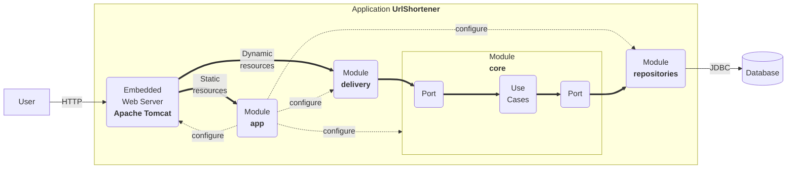

# URL Shortener - Web Engineering Project

[](https://github.com/UNIZAR-30246-WebEngineering/urlshortener/actions/workflows/ci.yml)

A Modern Clean Architecture Implementation with Kotlin, Spring Boot, and Value Objects.

## 🎯 Learning Objectives

This project demonstrates modern web engineering practices and serves as an educational example for:

- **Clean Architecture** implementation with clear separation of concerns
- **Domain-Driven Design** with value objects and sealed classes
- **Modern Kotlin** features including value classes and sealed classes
- **Spring Boot** best practices and dependency injection
- **RESTful API** design with OpenAPI documentation
- **Frontend development** with modern HTML5, CSS3, and vanilla JavaScript
- **Testing strategies** including unit, integration, and end-to-end tests
- **Build automation** with Gradle and modern tooling

## 🛠️ Technology Stack

This application showcases modern web engineering technologies and best practices:

### Core Technologies

1. **Programming Language**: [Kotlin 2.2.10](https://kotlinlang.org/)

   - Statically-typed, concise, and expressive language
   - Excellent interoperability with Java
   - Modern features: value classes, sealed classes, coroutines
   - Used for both backend and Android development

2. **Build System**: [Gradle 9.0](https://gradle.org/)

   - Modern build automation tool
   - Multi-module project support
   - Version catalogs for dependency management
   - Precompiled script plugins for code reuse

3. **Framework**: [Spring Boot 3.5.4](https://docs.spring.io/spring-boot/)

   - Production-ready framework for Java/Kotlin applications
   - Auto-configuration and opinionated defaults
   - Embedded web server (Tomcat)
   - Comprehensive ecosystem (Security, Data, Web, etc.)

### Additional Technologies

- **Frontend**: HTML5, CSS3, Bootstrap 5.3.3, Vanilla JavaScript
- **Database**: HSQLDB (in-memory for development)
- **API Documentation**: OpenAPI 3.0 with Swagger UI
- **Monitoring**: Spring Boot Actuator for health checks and metrics
- **Testing**: JUnit 5, Mockito, Spring Boot Test
- **Code Quality**: Detekt (static analysis)
- **Logging**: SLF4J with kotlin-logging

## 🏗️ Clean Architecture Implementation

This project follows [Clean Architecture](https://blog.cleancoder.com/uncle-bob/2012/08/13/the-clean-architecture.html) principles, specifically implementing the [Hexagonal Architecture](https://alistair.cockburn.us/hexagonal-architecture/) pattern (also known as Ports and Adapters). This approach ensures maintainability, testability, and independence from external frameworks.

### Module Structure

- **`core`** - Domain layer containing business logic, entities, and use cases

  - Domain entities with value objects and sealed classes
  - Use cases (business rules and application logic)
  - Ports (interfaces) for external dependencies
  - No knowledge of web frameworks or databases

- **`repositories`** - Infrastructure layer for data persistence

  - JPA entities and repositories
  - Database converters (domain ↔ persistence)
  - Implementation of core ports

- **`delivery`** - Interface layer for web exposure

  - REST controllers with OpenAPI documentation
  - Exception handlers and HTTP mapping
  - DTOs for API communication

- **`app`** - Application layer and configuration

  - Spring Boot configuration and dependency injection
  - Static web assets (HTML, CSS, JavaScript)
  - Application startup and module wiring



### Development Workflow

When adding new features, follow this clean architecture approach:

1. **Domain First**: Start in the `core` module

   - Define domain entities with value objects
   - Create use cases (business logic)
   - Define ports (interfaces) for external dependencies

2. **Infrastructure**: Implement in `repositories` module

   - Create JPA entities if needed
   - Implement port interfaces
   - Add database converters

3. **Interface**: Expose in `delivery` module

   - Create REST controllers
   - Add OpenAPI documentation
   - Handle HTTP-specific concerns

4. **Configuration**: Wire everything in `app` module

   - Configure Spring beans
   - Set up dependency injection
   - Add any necessary configuration

### Advanced Features

For more complex scenarios, consider:

- **`gateway`** module for external service integration
- Additional `app` modules for microservices architecture
- **`shared`** module for common utilities across modules

Features involving external integrations or multiple applications demonstrate advanced architectural understanding.

## 🎨 Modern Domain Modeling

This project showcases advanced Kotlin features for domain modeling:

### Value Objects

The domain uses `@JvmInline value class` for type safety without runtime overhead:

```kotlin
@JvmInline
value class UrlHash(val value: String) {
    init {
        require(value.isNotBlank()) { "URL hash cannot be blank" }
        require(value.length <= InputLimits.MAX_KEY_LENGTH) { 
            "URL hash length ${value.length} exceeds maximum ${InputLimits.MAX_KEY_LENGTH}" 
        }
    }
}
```

**Benefits**:

- **Type Safety**: Prevents mixing different string types
- **Zero Runtime Cost**: Compiled away to underlying type
- **Validation**: Input validation at creation time
- **Immutability**: Cannot be modified after creation

### Sealed Classes

Used for representing finite states and behaviors:

```kotlin
sealed class UrlSafety {
    object Safe : UrlSafety()
    object Unsafe : UrlSafety()
    object Unknown : UrlSafety()
}

sealed class RedirectionType(val statusCode: Int) {
    object Temporary : RedirectionType(HttpStatusCodes.TEMPORARY_REDIRECT)
    object Permanent : RedirectionType(HttpStatusCodes.PERMANENT_REDIRECT)
}
```

**Benefits**:

- **Exhaustive Pattern Matching**: Compiler ensures all cases are handled
- **Type Safety**: Cannot create invalid states
- **Extensibility**: Easy to add new states
- **Performance**: No runtime overhead

## 🚀 Getting Started

The application can be run as follows:

```bash
./gradlew bootRun
```

Now you have a shortener service running at port 8080. You can test that it works as follows:

```bash
$ curl -v -d "url=http://www.unizar.es/" http://localhost:8080/api/link
*   Trying ::1:8080...
* Connected to localhost (::1) port 8080 (#0)
> POST /api/link HTTP/1.1
> Host: localhost:8080
> User-Agent: curl/7.71.1
> Accept: */*
> Content-Length: 25
> Content-Type: application/x-www-form-urlencoded
> 
* upload completely sent off: 25 out of 25 bytes
* Mark bundle as not supporting multiuse
< HTTP/1.1 201 
< Location: http://localhost:8080/tiny-6bb9db44
< Content-Type: application/json
< Transfer-Encoding: chunked
< Date: Tue, 28 Sep 2025 17:06:01 GMT
< 
* Connection #0 to host localhost left intact
{"url":"http://localhost:8080/tiny-6bb9db44","properties":{"safe":true}}%   
```

And now, we can navigate to the shortened URL.

```bash
$ curl -v http://localhost:8080/6bb9db44
*   Trying ::1:8080...
* Connected to localhost (::1) port 8080 (#0)
> GET /tiny-6bb9db44 HTTP/1.1
> Host: localhost:8080
> User-Agent: curl/7.71.1
> Accept: */*
> 
* Mark bundle as not supporting multiuse
< HTTP/1.1 307 
< Location: http://www.unizar.es/
< Content-Length: 0
< Date: Tue, 28 Sep 2025 17:07:34 GMT
< 
* Connection #0 to host localhost left intact
```

## Build and Run

The uberjar can be built and then run with:

```bash
./gradlew build
java -jar app/build/libs/app-0.2025.1-SNAPSHOT.jar
```

## 📋 Core Functionalities

The application provides three main business capabilities:

### 1. URL Shortening (`CreateShortUrlUseCase`)

- **Purpose**: Convert long URLs into short, manageable links
- **Input**: URL string and optional metadata
- **Output**: Short URL with hash identifier
- **Validation**: URL format and safety checks
- **Implementation**: `core/usecases/CreateShortUrlUseCase.kt`

### 2. URL Redirection (`RedirectUseCase`)

- **Purpose**: Redirect users from short URLs to original destinations
- **Input**: Short URL hash
- **Output**: HTTP redirect response (307/301)
- **Features**: Click logging and analytics
- **Implementation**: `core/usecases/RedirectUseCase.kt`

### 3. Click Analytics (`LogClickUseCase`)

- **Purpose**: Track usage statistics and user behavior
- **Input**: Click event data (IP, referrer, browser, etc.)
- **Output**: Stored analytics data
- **Features**: Silent failure for non-critical logging
- **Implementation**: `core/usecases/LogClickUseCase.kt`

### Domain Entities

The domain model uses modern Kotlin features:

- **`ShortUrl`**: Core entity with `UrlHash`, `Redirection`, and `ShortUrlProperties`
- **`Redirection`**: Contains `Url` target and `RedirectionType` (Temporary/Permanent)
- **`Click`**: Analytics entity with `UrlHash` and `ClickProperties`
- **`ShortUrlProperties`**: Metadata using value objects (`IpAddress`, `Sponsor`, `Owner`, etc.)
- **`ClickProperties`**: Analytics data using value objects (`Browser`, `Platform`, `CountryCode`, etc.)

## 🌐 REST API Design

The application exposes a clean, RESTful API with comprehensive OpenAPI documentation:

### API Endpoints

#### 1. Create Short URL

```http
POST /api/link
Content-Type: application/x-www-form-urlencoded

url=https://example.com&sponsor=Marketing
```

**Response**:

```json
{
  "url": "http://localhost:8080/f684a3c4",
  "properties": {
    "safe": true
  }
}
```

#### 2. Redirect to Original URL

```http
GET /{hash}
```

**Response**: HTTP 307/301 redirect to original URL

#### 3. Landing Page

```http
GET /
```

**Response**: HTML page with URL shortening form

### API Documentation

- **Swagger UI**: <http://localhost:8080/swagger-ui.html>
- **OpenAPI Spec**: <http://localhost:8080/v3/api-docs>
- **Features**: Interactive testing, schema validation, example requests

### Content Types Supported

- `application/x-www-form-urlencoded` (traditional forms)
- `multipart/form-data` (modern forms with file uploads)
- `application/json` (API responses)

## 📊 Monitoring and Health Checks

The application includes Spring Boot Actuator for production-ready monitoring and management:

### Available Actuator Endpoints

The application exposes these actuator endpoints:

- **Health Check**: `GET /actuator/health` - Detailed application health status
- **Application Info**: `GET /actuator/info` - Application metadata (empty by default)
- **Actuator Discovery**: `GET /actuator` - Lists all available actuator endpoints

### Health Indicators (Verified)

The health endpoint provides detailed information about:

#### **Database Health**

```json
{
  "status": "UP",
  "details": {
    "database": "HSQL Database Engine",
    "validationQuery": "isValid()"
  }
}
```

#### **Disk Space Health**

```json
{
  "status": "UP", 
  "details": {
    "total": 994662584320,
    "free": 130849771520,
    "threshold": 10485760,
    "path": "/path/to/application",
    "exists": true
  }
}
```

#### **Additional Health Checks**

- **Ping**: Basic application responsiveness
- **SSL**: SSL certificate validation status

### Configuration

The actuator is configured in `application.yaml`:

```yaml
management:
  endpoint:
    health:
      show-details: always  # Shows detailed health information
  endpoints:
    web:
      exposure:
        include: health,info  # Exposes health and info endpoints
```

### Production Considerations

- **Security**: Actuator endpoints should be secured in production
- **Exposure**: Configure which endpoints are exposed via `management.endpoints.web.exposure.include`
- **Custom Health**: Add custom health indicators for business logic
- **Info Endpoint**: Configure `management.info.*` properties to populate application metadata

## 🗄️ Data Persistence

The application uses JPA/Hibernate for data persistence with clean architecture principles:

### Database Schema

#### `shorturl` Table

```sql
CREATE TABLE shorturl (
    hash VARCHAR(100) PRIMARY KEY,
    target VARCHAR(2048) NOT NULL,
    mode INTEGER NOT NULL,
    created TIMESTAMP NOT NULL,
    owner VARCHAR(255),
    sponsor VARCHAR(255),
    safe BOOLEAN NOT NULL,
    ip VARCHAR(45),
    country VARCHAR(2)
);
```

#### `click` Table

```sql
CREATE TABLE click (
    id BIGINT PRIMARY KEY AUTO_INCREMENT,
    hash VARCHAR(100) NOT NULL,
    created TIMESTAMP NOT NULL,
    ip VARCHAR(45),
    referrer VARCHAR(2048),
    browser VARCHAR(255),
    platform VARCHAR(255),
    country VARCHAR(2)
);
```

### Repository Pattern Implementation

The project implements the Repository pattern with clean separation:

1. **Domain Ports** (`core/Ports.kt`): Interfaces defining data access contracts
2. **Infrastructure Implementation** (`repositories/PortsImpl.kt`): JPA-based implementations
3. **Entity Converters** (`repositories/Converters.kt`): Domain ↔ Persistence mapping

### Key Features

- **Type Safety**: Value objects ensure data integrity
- **Clean Mapping**: Converters handle domain ↔ persistence transformation
- **Testability**: Repository interfaces enable easy mocking
- **Flexibility**: Easy to switch between different persistence technologies

## 🧪 Testing Strategy

The project implements comprehensive testing at multiple levels:

### Test Types

#### 1. Unit Tests (`core/src/test/`)

- **Use Case Tests**: Test business logic in isolation
- **Domain Tests**: Test value objects and domain rules
- **Mocking**: Use Mockito for external dependencies

#### 2. Integration Tests (`app/src/test/`)

- **HTTP Tests**: Test complete request/response cycles
- **Database Tests**: Test persistence layer integration
- **Spring Context**: Test application configuration

#### 3. Controller Tests (`delivery/src/test/`)

- **REST API Tests**: Test HTTP endpoints and responses
- **Exception Handling**: Test error scenarios
- **Content Type Tests**: Test different request formats

### Testing Best Practices

- **Arrange-Act-Assert**: Clear test structure
- **Given-When-Then**: BDD-style test naming
- **Isolation**: Each test is independent
- **Coverage**: Comprehensive exception testing
- **Realistic Data**: Use realistic test scenarios

### Running Tests

```bash
# Run all tests
./gradlew test

# Run specific module tests
./gradlew :core:test
./gradlew :delivery:test
./gradlew :app:test

# Run with coverage
./gradlew test jacocoTestReport
```

## 🎓 Educational Resources

### Core Concepts

- **Clean Architecture**: [Uncle Bob's Clean Architecture](https://blog.cleancoder.com/uncle-bob/2012/08/13/the-clean-architecture.html)
- **Domain-Driven Design**: [DDD Reference](https://domainlanguage.com/ddd/reference/)
- **SOLID Principles**: [SOLID Principles in Kotlin](https://kotlinlang.org/docs/object-oriented-programming.html)

### Technology Documentation

- **Kotlin**: [Official Kotlin Documentation](https://kotlinlang.org/docs/)
- **Spring Boot**: [Spring Boot Reference](https://docs.spring.io/spring-boot/docs/current/reference/htmlsingle/)
- **Gradle**: [Gradle User Manual](https://docs.gradle.org/current/userguide/userguide.html)
- **OpenAPI**: [OpenAPI Specification](https://swagger.io/specification/)

### Learning Guides

- [Building a RESTful Web Service with Spring Boot](https://spring.io/guides/gs/rest-service/)
- [Serving Web Content with Spring MVC](https://spring.io/guides/gs/serving-web-content/)
- [Accessing Data with JPA](https://spring.io/guides/gs/accessing-data-jpa/)
- [Testing Spring Boot Applications](https://spring.io/guides/gs/testing-web/)

## 🚀 Next Steps

### For Students

1. **Explore the Code**: Start with the `core` module to understand domain logic
2. **Run Tests**: Execute tests to see expected behavior
3. **Add Features**: Implement new use cases following clean architecture
4. **Experiment**: Try different approaches and learn from the codebase

### Potential Extensions

- **Authentication**: Add user management and security
- **Analytics Dashboard**: Create a web interface for click statistics
- **URL Validation**: Integrate with external URL validation services
- **Rate Limiting**: Implement API rate limiting
- **Caching**: Add Redis for improved performance
- **Microservices**: Split into separate services

## 🧰 Tooling & CI

- **CI**: GitHub Actions workflow `ci.yml`
  - JDK 17 (Temurin) with modern Gradle actions
  - Steps: `detekt`, `test`, `assemble`
  - Test reports uploaded on all outcomes
- **Static analysis**: Detekt wired into `check` with HTML, XML, TXT, and SARIF reports
- **Build performance**: configuration cache, build cache, and parallel enabled via `gradle.properties`

## 📝 Changelog

- 2025-10-20: CI updated to Gradle actions v3; detekt reports configured; tests run via `test` and artifacts via `assemble`; added Quarto-based README auto-render workflow; Gradle configuration cache and parallelism enabled. Removed Quarto automation and `README.qmd`; README is now maintained directly in `README.md`.
