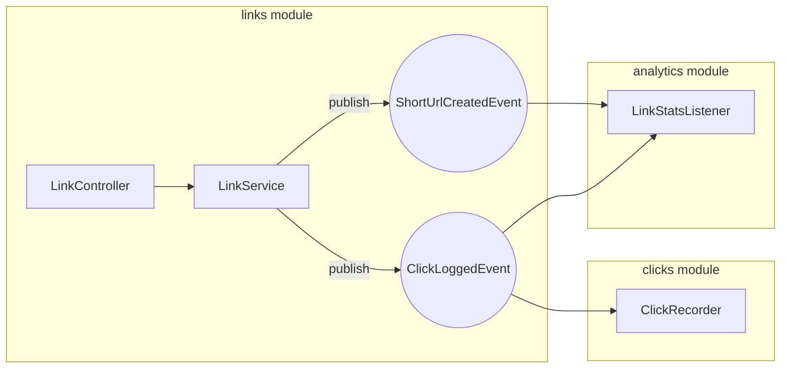

# urlshortener (IW 2627 seed)

**This** repo is the URL Shortener product seed for 2627 group projects.

## Product (minimum expected)

**Graded deliverable:** Boot jar(s) **plus** this Compose stack (Postgres + 2 app replicas + LB) — not “jar on localhost only.”

Day-to-day coding uses `./gradlew bootRun` (in-memory HSQLDB). Demo, scale evidence, and grading use Compose:

| Layer | Command |
| --- | --- |
| Product | `docker compose up --build` → LB `http://localhost:8080` |
| Load (same project) | `docker compose --profile load run --rm k6` or host `scripts/load.k6.js` |
| Optional broker stub | `docker compose --profile broker up` |

## Provided vs grown

**Provided (seed, weight 0):** 

- Modulith application modules: `links`, `clicks`, `analytics`.
- Seed feature cards (implemented):
  - [`0001-create-short-url`](docs/features/0001-create-short-url.md) — `POST /api/link`
  - [`0002-redirect-and-click-log`](docs/features/0002-redirect-and-click-log.md) — `GET /{hash}` + permanent click log
  - [`0003-link-stats`](docs/features/0003-link-stats.md) — `GET /api/stats/{hash}`
- Per-module hexagon with **jMolecules** stereotypes and ArchUnit guards.
- Compose product stack.
- ADRs under `docs/adr/`.
- `AGENTS.md`.
- k6 load script + replica-failover smoke (`scripts/scale-baseline.sh`).

**Grown (students):**

- New feature cards from [`0004-…`](docs/features/README.md) (Σ weights = 84; ≥4 features; ≥2 event-coupled). The three seed features are ignored when counting.
- Code in owner modules (`links` / `clicks` / `analytics` or a new module) — keep hexagon + `ApplicationModules.verify()` green.
- Scale evidence as claimed on cards: [`replica-failover`](scripts/scale-baseline.sh), [`load-compare`](scripts/load.k6.js), `cross-instance` (`--profile broker`). Architecture verify (`ModularityTests`) counts toward **engineering / ADR**, not scale.
- ADRs under [`docs/adr/`](docs/adr/README.md) when a choice locks modules, events, Level 4, or tech ([`0000-TEMPLATE.md`](docs/adr/0000-TEMPLATE.md); seed [`0001`](docs/adr/0001-modulith-and-hexagon.md)).
- Specialised technologies (≥2) and optional Web UI / module extraction.
- Defence packet: cite feature cards, ADRs, and the commands/tests that prove them.
- Personal names, ownership, and integrator role are in **`TEAM.md`** (see `TEAM.md.example`). That file is git-ignored and must not be committed, but must be included in the zip submission.

## Local dev (no Docker)

```bash
./gradlew bootRun         # HSQLDB in-memory
./gradlew test            # Modulith verify + hexagonal ArchUnit + flow test
./gradlew check           # All gates: ktlint + detekt + test + JaCoCo (60%)
./gradlew ktlintFormat    # Auto-fix style issues
```

## Quality gates (CI enforced)

| Gate | Tool | Threshold |
| --- | --- | --- |
| Code style | ktlint | Zero violations |
| Static analysis | detekt | Zero issues (see `config/detekt.yml`) |
| Coverage | JaCoCo | ≥60% line coverage (whole project). Per-module HTML: `build/reports/jacoco/<module>/html/index.html` for `links`, `clicks`, `analytics` |
| Architecture | Modulith + jMolecules | `verify()` + `ensureHexagonal(SEMI_STRICT)` |

## Architecture

Modulith modules are the **bounded contexts**. Inside each module, use a small hexagon:

| Layer | Role |
| --- | --- |
| base package | Public API (events other modules may import) |
| `domain` | Framework-free model (`@Application`) |
| `application` | Use cases + `@PrimaryPort` / `@SecondaryPort` |
| `adapters.*` | `@PrimaryAdapter` / `@SecondaryAdapter` (web, JPA, events, tech) |

`ApplicationModules.verify()` enforces closed-module rules and jMolecules hexagon (`ensureHexagonal(SEMI_STRICT)`). Do not reach into another module’s internals.

### Decisions (required for grown work)

Decide explicitly; do not inherit the seed silently when you change structure or stack.

| Decision | Seed default | If you change it |
| --- | --- | --- |
| Module boundaries | `links` / `clicks` / `analytics` | New ADR + keep `verify()` green |
| Hexagon enforcement | jMolecules stereotypes + `ensureHexagonal(SEMI_STRICT)` in `ModularityTests` | ADR (e.g. drop jMolecules, or move to `STRICT`) |
| Cross-module API | Events in module base packages | ADR (named interfaces / allowedDependencies) |
| Async across replicas | In-process only | ADR for Level-4 broker path |

Defence packet: list ADRs + the command/test that proves each decision.

## Events

- `links.ShortUrlCreatedEvent` (published by `links`) → `analytics` creates zeroed `LinkStats`
- `clicks.ClickLoggedEvent` (type in `clicks`; published by `links` on redirect) → `clicks` appends a log row; `analytics` increments `LinkStats`

In-process events do **not** cross replicas. Level 4 = externalize via broker (`--profile broker`).



## Scale evidence

| Evidence | When required | Artifact | Command |
| --- | --- | --- | --- |
| `replica-failover` | Horizontal claimed | Create/redirect via LB; kill one replica; shared DB still serves | `./scripts/scale-baseline.sh` then `docker compose stop app2` |
| `load-compare` | Horizontal **or** weight ≥13 | Same script N=1 vs N=2; RPS + p95 + error rate + interpretation | `docker compose --profile load run --rm k6` |
| `cross-instance` | Level 4 claimed | Side-effect across instances + idempotency | Broker integration + test |

Architecture gates (`ModularityTests`, `ensureHexagonal`) belong in **engineering / ADRs**, not in this table.

## First 30 minutes

```bash
# 1. Clone your private repo (fork / copy from this seed)
git clone https://github.com/UNIZAR-30246-WebEngineering/<your-repo>.git
cd <your-repo>

# 2. Check the build passes (ktlint + detekt + test + JaCoCo)
./gradlew check          # all quality gates must be green before you start

# 3. Run locally (HSQLDB in-memory)
./gradlew bootRun        # → http://localhost:8080

# 4. Try the three seed endpoints
http POST localhost:8080/api/link url=https://example.com
http GET  localhost:8080/<hash>    --follow
http GET  localhost:8080/api/stats/<hash>

# 5. Bring up the full product stack (Postgres + 2 replicas + LB)
docker compose up --build   # → LB on http://localhost:8080

# 6. Run the load profile (optional, produces load-compare evidence)
docker compose --profile load run --rm k6
```

Once the stack is up and you can create, redirect, and fetch stats, you are ready to fill your agreement.

## Project Agreement (October 2)

1. **Budget**: Σ weights = 84; ≥ 4 grown features (one per member); ≥ 2 event-coupled. Weights: 5 · 8 · 13 · 21 (= ExpectedLevel 1–4). The three seed features do not count. Full rules: [`project.pdf`](https://unizar-30246-webengineering.github.io/web-engineering/assets/assignments/project.pdf).
2. **Feature cards**: for each grown feature, copy [`docs/features/0000-TEMPLATE.md`](https://github.com/UNIZAR-30246-WebEngineering/UrlShortener/blob/main/docs/features/0000-TEMPLATE.md) → `0004-….md`. Paste the catalogue entry from `guidance.pdf` into `## Decision` and choose a weight. Leave `## Later` empty.
3. **Cover sheet**: fill [`AGREEMENT.md`](https://github.com/UNIZAR-30246-WebEngineering/UrlShortener/blob/main/AGREEMENT.md) — feature rows (no personal names), budget totals.
4. **TEAM.md**: copy `TEAM.md.example` → `TEAM.md` on one member's machine. Fill in personal names, UNIZAR emails, git identity, owned features, and integrator. Do not commit it — include it in the zip.
5. **Submit**: upload a zip of the git repository via Moodle.
