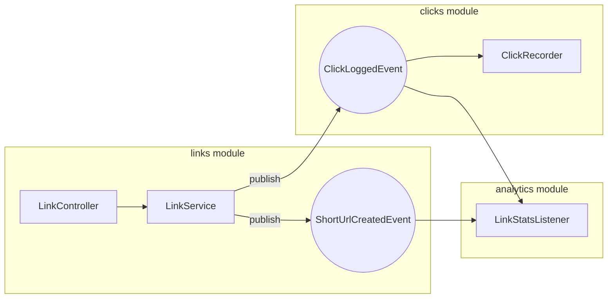

# urlshortener (IW 2627 seed)

**This** repo is the URL Shortener product seed for 2627 group projects.

## Product (minimum expected)

**Graded deliverable:** Boot jar(s) **plus** this Compose stack (Postgres + 2 app replicas + LB) — not “jar on localhost only.”

Day-to-day coding uses `./gradlew bootRun` (in-memory HSQLDB). Demo and grading use Compose:

| Layer | Command |
| --- | --- |
| Product | `docker compose up --build` → LB `http://localhost:8080` |
| Load (same project) | `docker compose --profile load run --rm k6` or host `scripts/load.k6.js` |
| Optional broker stub | `docker compose --profile broker up` |

## Provided vs grown

**Provided (seed, weight 0):** 

- Modulith application modules: `links`, `clicks`, `analytics`.
- Seed feature cards (implemented):
  - [`0001-create-short-url`](docs/features/0001-create-short-url.md) — `POST /api/link`
  - [`0002-redirect-and-click-log`](docs/features/0002-redirect-and-click-log.md) — `GET /{hash}` + permanent click log
  - [`0003-link-stats`](docs/features/0003-link-stats.md) — `GET /api/stats/{hash}`
- Per-module hexagon with **jMolecules** stereotypes and ArchUnit guards.
- Compose product stack.
- ADRs under `docs/adr/`.
- `AGENTS.md`.

**Grown (students):**

- New feature cards from [`0004-…`](docs/features/README.md). Weights **5 · 8 · 13 · 21** (ExpectedLevel 1–4). **Σ = 84**. **≥ 4** grown features (one per member). **≥ 2** event-coupled. Seed cards weigh 0 and are ignored in those counts.
- **Event-coupled Y** means the feature publishes or consumes a domain event. Reaching Level 3 (weight **13**) or Level 4 (weight **21**) needs a **new** event type. Reusing `ShortUrlCreatedEvent` or `ClickLoggedEvent` does not reach those levels. A card may still say **N**; that delivery scores as Level 2.
- Code in owner modules (`links` / `clicks` / `analytics` or a new module) — keep hexagon + `ApplicationModules.verify()` green.
- Weight **21** (Level 4) needs an external broker. `docker compose --profile broker up` only starts the stub; the apps are not wired to it. Students wire externalization.
- ADRs under [`docs/adr/`](docs/adr/README.md) when a choice locks a module, the broker, or a library ([`0000-TEMPLATE.md`](docs/adr/0000-TEMPLATE.md); seed [`0001`](docs/adr/0001-modulith-and-hexagon.md)).
- Technologies beyond baseline HTTP, in distinct grown features: Call-Return, Event-Based, and Data Flow. Modulith events and the broker count toward architecture, not this slice. Web UI is not graded.
- Defence packet: filled feature cards, ADR log, and a live Compose demo (create, redirect, stats).
- Personal names, ownership, and the integration owner are in **`TEAM.md`** (see `TEAM.md.example`). That file is git-ignored and must not be committed, but must be included in the zip.

## Local dev (no Docker)

```bash
./gradlew bootRun         # HSQLDB in-memory
./gradlew test            # Modulith verify + hexagonal ArchUnit + flow test
./gradlew check           # All gates: ktlint + detekt + test + JaCoCo (60%)
./gradlew ktlintFormat    # Auto-fix style issues
```

## Quality gates (CI enforced)

| Gate | Tool | Threshold |
| --- | --- | --- |
| Code style | ktlint | Zero violations |
| Static analysis | detekt | Zero issues (see `config/detekt.yml`) |
| Coverage | JaCoCo | ≥60% line coverage (whole project). Per-module HTML: `build/reports/jacoco/<module>/html/index.html` for `links`, `clicks`, `analytics` |
| Architecture | Modulith + jMolecules | `verify()` + `ensureHexagonal(SEMI_STRICT)` |

## Architecture

Modulith modules are the **bounded contexts**. Inside each module, use a small hexagon:

| Layer | Role |
| --- | --- |
| base package | Public API (events other modules may import) |
| `domain` (where present) | Framework-free model (`@Application`). Only `links` has one |
| `application` | Use cases + `@PrimaryPort` / `@SecondaryPort` |
| `adapters.*` | `@PrimaryAdapter` / `@SecondaryAdapter` (web, JPA, events, tech) |

`ApplicationModules.verify()` enforces closed-module rules and jMolecules hexagon (`ensureHexagonal(SEMI_STRICT)`). Do not reach into another module’s internals.

### Decisions (required for grown work)

Decide explicitly; do not inherit the seed silently when you change structure or stack.

| Decision | Seed default | If you change it |
| --- | --- | --- |
| Module boundaries | `links` / `clicks` / `analytics` | New ADR + keep `verify()` green |
| Hexagon enforcement | jMolecules stereotypes + `ensureHexagonal(SEMI_STRICT)` in `ModularityTests` | ADR (e.g. drop jMolecules, or move to `STRICT`) |
| Cross-module API | Events in module base packages | ADR (named interfaces / allowedDependencies) |
| Async across replicas | In-process only | ADR for Level-4 broker path |

Defence packet: list ADRs + the command/test that proves each decision.

## Events

- `links.ShortUrlCreatedEvent` (published by `links`) → `analytics` creates zeroed `LinkStats`
- `clicks.ClickLoggedEvent` (type in `clicks`; published by `links` on redirect) → `clicks` appends a log row; `analytics` increments `LinkStats`

In-process events do **not** cross replicas. The seed `--profile broker` only starts the broker; it does not externalise events.



## First 30 minutes

```bash
# 1. Clone your private repo (fork / copy from this seed)
git clone https://github.com/UNIZAR-30246-WebEngineering/<your-repo>.git
cd <your-repo>

# 2. Check the build passes (ktlint + detekt + test + JaCoCo)
./gradlew check          # all quality gates must be green before you start

# 3. Run locally (HSQLDB in-memory)
./gradlew bootRun        # → http://localhost:8080

# 4. Try the three seed endpoints (create takes form or multipart `url`, not JSON)
http POST localhost:8080/api/link url=https://example.com
http GET  localhost:8080/<hash>    --follow
http GET  localhost:8080/api/stats/<hash>

# 5. Stop bootRun (same port), then bring up the product stack
docker compose up --build   # Postgres + 2 replicas + LB → http://localhost:8080
```

Once the stack is up and you can create, redirect, and fetch stats, you are ready to fill your agreement.

## Project Agreement (October 2)

Full rules: [Group Project](https://moodle.unizar.es/add/course/section.php?id=1702745). Catalogue: [Feature Catalogue](https://moodle.unizar.es/add/mod/resource/view.php?id=12167300). Keep the repository **private**.

| Weight | ExpectedLevel | Required approach |
| --- | --- | --- |
| **5** | 1 | Synchronous Spring MVC |
| **8** | 2 | Async threads, coroutines, or `@Async` |
| **13** | 3 | In-process Modulith events (`@ApplicationModuleListener`). A **new** event type is required to reach this level; the card may still say N |
| **21** | 4 | External broker. A **new** event type is required to reach this level. `--profile broker` only starts the stub |

1. **Feature cards**: copy [`docs/features/0000-TEMPLATE.md`](docs/features/0000-TEMPLATE.md) → `0004-….md`. Paste the catalogue entry into `## Decision` and choose a weight. Leave `## Later` empty. No personal names.
2. **Cover sheet**: fill [`AGREEMENT.md`](AGREEMENT.md) — grown feature rows (owner module, weight, event-coupled) and budget totals (Σ = 84, grown ≥ 4, event-coupled ≥ 2). No personal names.
3. **TEAM.md**: copy `TEAM.md.example` → `TEAM.md`. Personal names, UNIZAR emails, git identity, owned features, and the integration owner. Do not commit it.
4. **Submit**: upload a zip of the working directory via Moodle by **2 October** (the zip includes `TEAM.md`).

Fill `## Later` after the agreement, when a choice locks an ADR. By **23 October** (proof of concept): one grown event end to end, and `docker compose up` starts cleanly. By **27 November** (prototype): one grown feature at Level 3 or higher (weight ≥ 13), its acceptance criteria, and CI green. By the defence (**17–18 December**): qualities self-assessment and AI disclosure.
